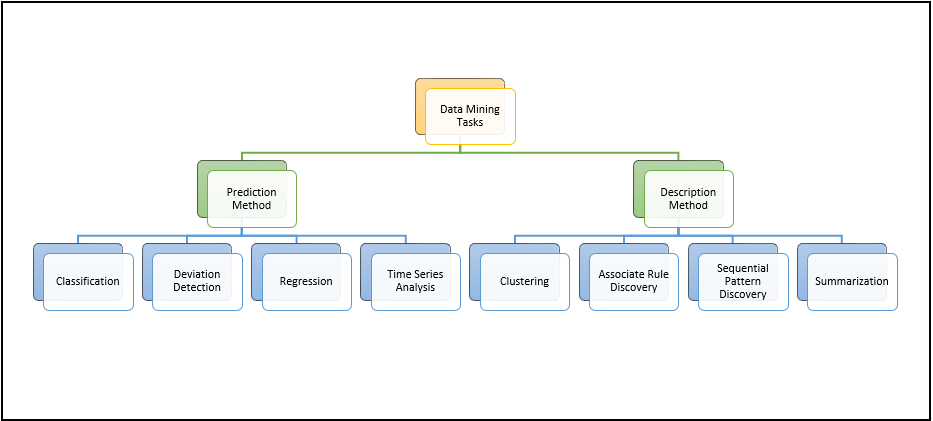

# Tennis match analysis

In this project we carried out several data mining [tasks](assignment.pdf) on a dataset containing informations about 186 000 tennis matches. There were several steps, initially a data understanding phase and then a feature engineering phase, with the aim of defining a new dataset containing player profiles. Then, we applied clustering analysis (k-means, DBSCAN, hierarchical clustering, EMA, X-means, C-means) to identify a potential interesting pattern among the players. Finally, we created a label to discriminate strong players from weak players and applied several classification techniques (Random Forest, AdaBoost, Neural Networks, SVM, Decision Tree, Rule Based, KNN, Naive Bayes). The project concludes with the analysis of some time series on the temperatures of some world cities. A detailed explanation showing the results and the choices made can be found in the [report](report/tennis.pdf).

## Quickstart

### 1 - Install dependencies

With **PIP**

    pip install -r requirements.txt

With **CONDA**

    conda create --name <env_name> --file requirements.txt

### 2 - Run notebooks

In order to run the jupyter notebooks, first execute `jupyter notebook` and then run the notebooks in the order specified by the numbers in the file name.

Note: project done in collaboration with Alex Colucci. Implemented for the Data Mining course 2021.